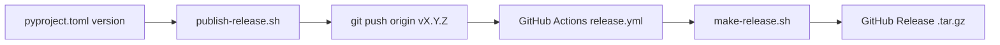

# Publishing a release

Releases are **automated on GitHub** when you push a version tag. The workflow builds the macOS tarball and attaches it to a GitHub Release.

## Release flow



## First release (example)

From your clone of the repository (use your actual checkout path, not a machine-specific absolute path):

```bash
cd ~/github/digg-consulting/offline-video-scribe   # example; any clone location is fine

# Commit release-ready changes; version in pyproject.toml (e.g. 0.1.0)
git add -A && git commit -m "chore: prepare release 0.1.0"   # if needed
git push origin main

./scripts/publish-release.sh --dry-run   # preview
./scripts/publish-release.sh             # tag v0.1.0 and push
```

Then open **Actions → Release** and **Releases** on GitHub. After CI succeeds, users can install with `OVS_VERSION=0.1.0` via [INSTALL.md](INSTALL.md).

## One-command publish (recommended)

From a clean commit on `main` with the version already set in `pyproject.toml`:

```bash
./scripts/publish-release.sh
```

That creates an annotated tag `v<version>` (from `pyproject.toml`) and runs `git push origin v<version>`. GitHub Actions does the rest.

Preview only:

```bash
./scripts/publish-release.sh --dry-run
```

## What runs automatically

On push of tag `v*` (see [.github/workflows/release.yml](../.github/workflows/release.yml)):

1. Checkout repo on `macos-latest`
2. `./scripts/make-release.sh` → `dist/offline-video-scribe-<version>-macos.tar.gz`
3. Create/update GitHub Release for that tag and upload the tarball
4. Generate release notes from commits

Users can then install with:

```bash
OVS_VERSION=<version> curl -fsSL .../bootstrap-install.sh | bash
```

or by downloading the asset from the [Releases](https://github.com/digg-consulting/offline-video-scribe/releases) page.

## After publish: how users upgrade

Publishing a new tag does **not** change installed Macs automatically. Tell users to upgrade the CLI with the new tarball (or a fresh bootstrap extract), then run `update.sh`.


**End users (release tarball):**

```bash
tar xzf offline-video-scribe-<new-version>-macos.tar.gz
cd offline-video-scribe-<new-version>-macos
./update.sh
```

**Bootstrap installs:** extract the new release under `~/.local/share/digg/offline-video-scribe-releases/` (or any path) and run `./update.sh` there.

**Developers (git clone):**

```bash
cd ~/github/digg-consulting/offline-video-scribe
git pull
./update.sh
```

Upgrade does not re-download models or overwrite `config.yaml`. Full details: [INSTALL.md — Upgrade](INSTALL.md#upgrade).

Optional release notes line for GitHub:

```text
## Upgrade
Download offline-video-scribe-<version>-macos.tar.gz, extract, and run ./update.sh
See docs/INSTALL.md
```

## Manual steps (same result)

### 1. Set the version

Edit `version` in [pyproject.toml](../pyproject.toml), e.g. `0.1.1`.

Commit and push to `main`:

```bash
git add pyproject.toml
git commit -m "chore: release 0.1.1"
git push origin main
```

### 2. Tag and push

Tag must be **`v` + the same version** as `pyproject.toml` (e.g. `v0.1.1`):

```bash
git tag -a v0.1.1 -m "Release 0.1.1"
git push origin v0.1.1
```

### 3. Watch CI

GitHub → **Actions** → **Release** workflow for that tag.

When it finishes, the Release page lists `offline-video-scribe-0.1.1-macos.tar.gz`.

## Local tarball only (no publish)

```bash
./scripts/make-release.sh
# → dist/offline-video-scribe-0.1.0-macos.tar.gz
```

Useful to test the archive before tagging.

## Requirements

| Requirement | Why |
|-------------|-----|
| `version` in `pyproject.toml` | Drives tarball name and tag check |
| Tag format `vX.Y.Z` | Triggers workflow (`v*`) |
| Tag matches version | `v0.1.0` ↔ `version = "0.1.0"` |
| `contents: write` on GITHUB_TOKEN | Workflow uploads the release asset (default for repo Actions) |

## Fixing a failed release

- Delete the remote tag: `git push origin :refs/tags/v0.1.0`
- Delete the GitHub Release (if created) in the UI
- Fix the issue, re-tag, push again

## Do not tag until

- Tests pass: `uv run python -m pytest`
- You intend that `pyproject.toml` version to be public (bootstrap script pins `OVS_VERSION`)
